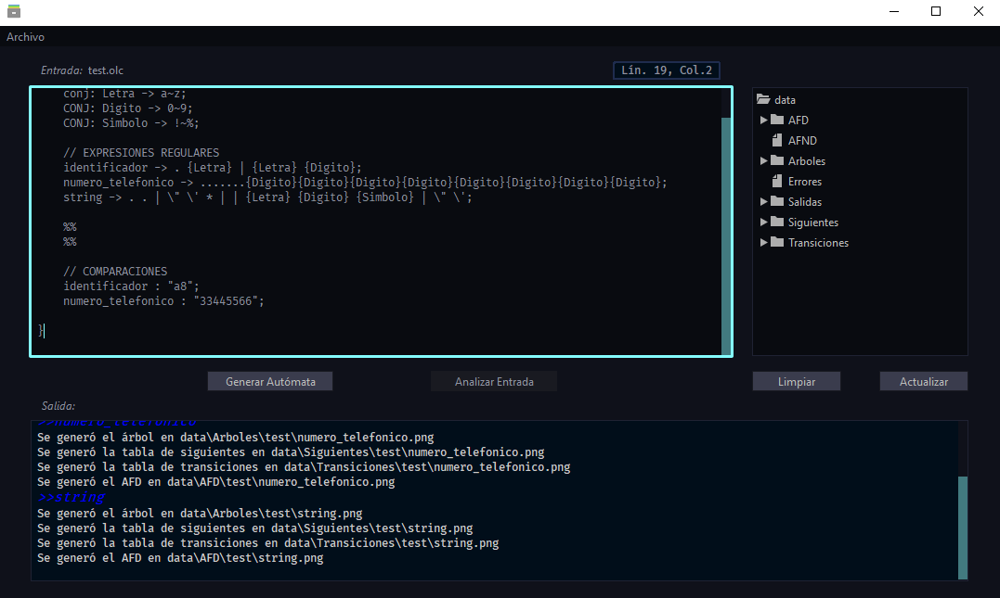
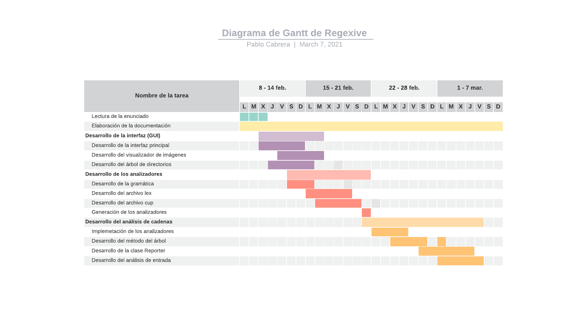

# [Regexive](index.md)

# 1. Manual Técnico

## 1.1. Índice

- [1. Manual Técnico](#1-manual-técnico)
  - [1.1. Índice](#11-índice)
  - [1.2. Glosario](#12-glosario)
  - [1.3. Objetivos](#13-objetivos)
    - [1.3.1. General](#131-general)
    - [1.3.2. Específicos](#132-específicos)
  - [1.4. Alcances del proyecto](#14-alcances-del-proyecto)
  - [1.5. Requerimentos funcionales](#15-requerimentos-funcionales)
  - [1.6. Atributos del sistema](#16-atributos-del-sistema)
  - [1.7. Lenguaje OLC](#17-lenguaje-olc)
    - [1.7.1. Definición del alfabeto](#171-definición-del-alfabeto)
    - [1.7.2. Definición de la sintáxis](#172-definición-de-la-sintáxis)
    - [1.7.3. Reporte de errores](#173-reporte-de-errores)
  - [1.8. Interfaz gráfica (GUI)](#18-interfaz-gráfica-gui)
  - [1.9. Método del árbol](#19-método-del-árbol)
  - [1.10. Generar autómata](#110-generar-autómata)
  - [1.11. Analizar entrada](#111-analizar-entrada)
  - [1.12. Diagrama de clases](#112-diagrama-de-clases)
  - [1.13. Diagrama de Gantt](#113-diagrama-de-gantt)

## 1.2. Glosario
*Referirse al siguiente [enlace](user.md#13-glosario).*

## 1.3. Objetivos

### 1.3.1. General
- Desarrollo de una aplicación gráfica con soporte de manipulación y creación de archivos, soporte de un lenguaje OLC para la creación de conjuntos, expresiones regulares y validación de cadenas.

### 1.3.2. Específicos
- Desarrollar la función de creación y verificación de expresiones regulares.
- Desarrollar el reporte del proceso de creación de AFD y permitir la visualización
- Elaborar reportes de salidas de comparación y de errores de entrada de forma automática.

## 1.4. Alcances del proyecto
Regexive es un proyecto del curso Organización de Lenguajes y Compiladores 1. Este proyecto pretende ekdjskdjs mediante una interfaz gráfica ejecutable, así como llevar a cabo el análisis léxico y sintáctico de la entrada de texto, con el fin de definir conjuntos, definir expresiones regulares y demandar comparaciones de cadenas con expresioness regulares ya creadas.

## 1.5. Requerimentos funcionales
- La aplicación permitirá la generación de reportes del método del árbol.
- La aplicación generará AFD de las expresiones regulares.
- La aplicación facilitará la manipulación de archivos locales.
- La aplicación permitirá la creación de archivos locales.
- La aplicación podrá crear conjuntos de caracteres de forma versátil.
- La aplicación manejará detección, recuperación y reporte de errores léxicos y sintácticos.
- La aplicación permitirá visualizar archivos locales.
- La aplicación facilitará el análisis de cadenas mediante expresiones regulares.

## 1.6. Atributos del sistema
- Fiabilidad de resultados
- Intuitividad de uso
- Estabilidad
- Prioridad en user experience (UX)
- Versatilidad de uso

## 1.7. Lenguaje OLC
La definición del lenguaje OLC se puede consultar en el siguiente [enlace](user.md#16-lenguaje-olc).

La definición del lenguaje se divide en dos partes:

### 1.7.1. Definición del alfabeto
El alfabeto de un lenguajes se trata de todos los símbolos que forman parte de este. El alfebeto se puede consultar en el siguiente [enlace](grammar.md#alfabeto).

El alfabeto se transcribe en un archivo .lex con el fin de que sea procesado por la librería JLex para Java. Esta librería se encarga de reconocer los tokens del alfabeto al recibir una entrada de texto, y devolver los símbolos para el uso de un analizador sintáctico.

### 1.7.2. Definición de la sintáxis
La sintáxis de un lenguaje se trata de la definición del correcto orden de los token para dicho lenguaje. La sintáxis del lenguaje se puede consultar en el siguiente [enlace](grammar.md#sintáxis).

La sintáxis de un lenguaje de programación define producciones, las cuales tienen el objetivo de validar el orden de la entrada. Las producciones del lenguaje OLC se transcribieron en un archivo .cup, que posteriormente fue analizado por la librería JCup para Java. La librería recibe los símbolos reconocidos por el analizador léxico y realiza producciones para validar el orden de los símbolos.

### 1.7.3. Reporte de errores
JLex y JCup manejan errores léxicos y sintácticos respectivamente.
JLex reconoce cualquier símbolo que no pertenezca al lenguaje OLC, mientras que JCup reporta cualquier orden erróneo de instrucciones.

Si se encuentra cualquier error en la entrada se genera un reporte de errores con el nombre del fichero OLC dentro de la carpeta *data/Errores*. De ser este el caso no se generarán otros reportes ni los AFD de las expresiones regulares.

## 1.8. Interfaz gráfica (GUI)
La interfaz de Regexive fue desarrollada utilizando Java Swing.

La interfaz principal (MainGUI) es la interfaz donde el usuario realiza la mayoría de acciones.

Se utilizan múltiples ActionListener para comodidad:
- Visualización de línea y columna actuales.
- Función undo-redo
- Actualización de directorios locales.

## 1.9. Método del árbol
Al definir una o más expresiones regulares se genera un árbol representativo de dicha expresión por medio de la clase Tree. Dicho árbol es utilizado para usar el método del árbol.

El método del árbol es un método utilizado para obtener un AFD eficiente a través de una serie de pasos:

1. Concatenar a la expresión el símbolo '#' que representa el final de la cadena.
2. Númerar las hojas del árbol.
3. Definir los anulables de los nodos del árbol.
4. Definir los 'primeros' de los nodos del árbol.
5. Definir los 'últimos' de los nodos del árbol.
6. Obtener la tabla de siguientes.
7. Obtener la tabla de transiciones.
8. Obtener el AFD mínimo.

## 1.10. Generar autómata

Esta serie de pasos se lleva a cabo al presionar el botón 'Generar Autómata'.

1. Analizar el léxico de la entrada mediante la clase Scanner.
2. Analizar la sintáxis de los símbolos reconocidos por el anaizador léxico, mediante el método 'parse()' de la clase Parser.
3. Si se encuentran errores se genera un reporte de errores en HTML y se detiene la ejecución. De lo contrario pasa al siguiente paso.
4. Extraer los símbolos reconocidos, conjuntos defininidos, expresiones definidas y comparaciones especificadas de los analizadores.
5. Iterar sobre cada expresión regular.
   1. Generar el árbol de la expresión regular al crear un objeto de la clase Tree con dicha expresión.
   2. Iterar sobre el árbol y determinar el anulable, los 'primeros', y los 'últimos' de cada nodo.
   3. Obtener la tabla de siguientes, utilizando el método 'next()' del nodo raíz del árbol.
   4. Obtener la tabla de transiciones mediante la clase TransitionTable.
   5. Iterar recursivamente sobre el árbol y generar un reporte de este mediante GraphViz en la carpeta *data/Árboles*.
   6. Iterar sobre la tabla de siguientes del árbol y generar un reporte de la tabla con GraphViz en la carpeta *data/Siguientes*.
   7. Iterar sobre la tabla de transiciones de los nodos y generar un reporte de la tabla de transiciones con GraphViz *data/Transiciones*.
   8. Iterar sobre la tabla de transiciones y generar los nodos del AFD con la clase State. Luego definir el nodo inicial como el nodo inicial de un objeto de la clase AFD. 
   9. Iterar sobre el AFD recursivamente y generar un reporte gráfico en la carpeta *data/AFD*.
   10. Guardar el AFD en una lista para el posterior análisis de cadenas.

## 1.11. Analizar entrada
Al presionar el botón 'Analizar Entrada' se valida que existan AFD en la lista de AFDs. Si no existe se pregunta si se desean generar. Si existen realiza los siguientes pasos:

1. Empezar a escribir un archivo Json con el nombre del archivo OLC actual.
2. Iterar sobre cada expresión regular definida.
   1. Validar que exista el AFD para dicha expresión. Si no existe continua con la siguiente expresión regular. De lo contrario continua con el siguiente paso.
   2. Escribir el identificador de la expresión regular y la entrada de comparación en el Json.
   3. Utilizar el método 'Evaluate(lexema)' de la clase AFD con la entrada de comparación. Este método itera sobre la cadena de entrada caracter por caracter y verifica que pueda transicionar en el AFD y acabar en un estado final.
   4. Si el método devuelve 'verdadero' se escribe 'Cadena Válida' en el Json, de lo contrario se escribe 'Cadena No Válida'.
   5. Se guarda el Json en la carpeta *data/Salidas*.

## 1.12. Diagrama de clases

## 1.13. Diagrama de Gantt

