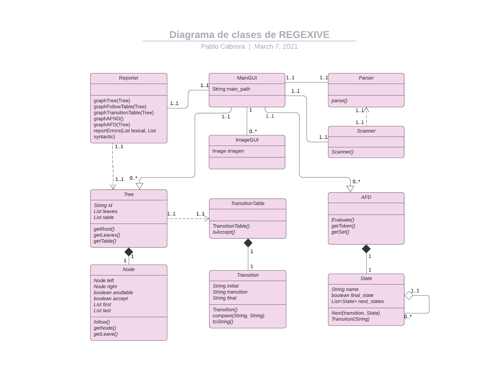

# 1. Manual Técnico

## 1.1. Índice

- [1. Manual Técnico](#1-manual-técnico)
  - [1.1. Índice](#11-índice)
  - [1.2. Introducción](#12-introducción)
  - [1.3. Objetivos](#13-objetivos)
    - [1.3.1. General](#131-general)
    - [1.3.2. Específicos](#132-específicos)
  - [1.4. Alcances del proyecto](#14-alcances-del-proyecto)
  - [1.5. Requerimentos funcionales](#15-requerimentos-funcionales)
  - [1.6. Atributos del sistema](#16-atributos-del-sistema)
- [2. subtitulooo guapoo](#2-subtitulooo-guapoo)
  - [2.1. Diagrama de clases](#21-diagrama-de-clases)
  - [2.2. Diagrama de Gantt](#22-diagrama-de-gantt)

## 1.2. Introducción
Regexive jsadhjsadh

## 1.3. Objetivos

### 1.3.1. General

gen

### 1.3.2. Específicos

- Proporcionar seguridad sobre la información que se almacene en este gestor de bases de datos.
- Brindar un servicio funcional y beneficioso.
- Permitir que los recursos consumidos a traves de este gestor sean bajos.
- Brindar informes gráficos sobre los registros para verificar su integridad.
- Permitir elegir modos de almacenamiento para que el usuario pueda indicar las estructuras que desea implementar.
- Beindar al usuario graficos para mejor entendimiento de las funcionalidades de la estructura seleccionada.

## 1.4. Alcances del proyecto
Este proyecto pretende

## 1.5. Requerimentos funcionales

- La caplicación es capaz de 
- Se puede bla bla

## 1.6. Atributos del sistema

- Fiabilidad
- Estabilidad
- UX

# 2. subtitulooo guapoo

cuerpo

## 2.1. Diagrama de clases

## 2.2. Diagrama de Gantt

